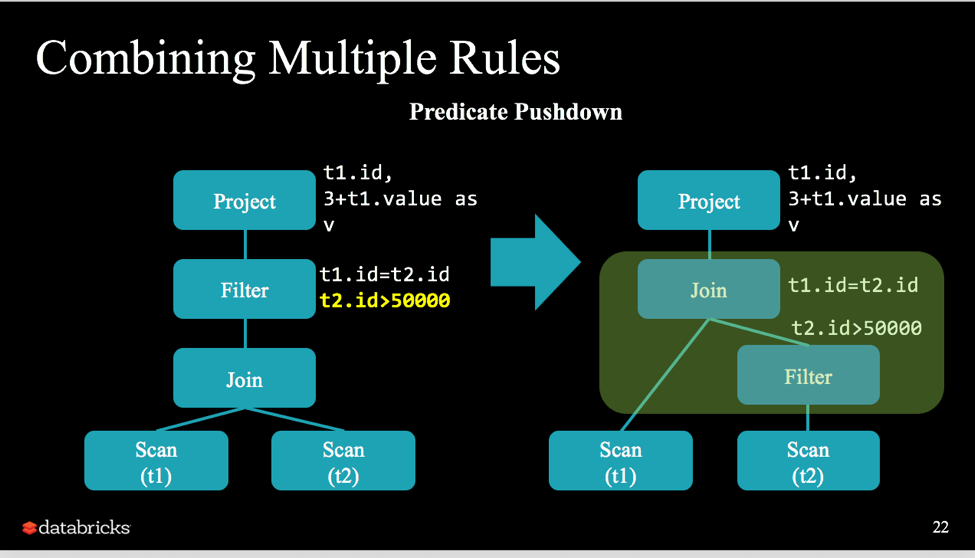

### 谓词下推(Predicate Pushdown)


如图所示：


源码如下：

```scala
/**
  * Pushes certain operations to both sides of a Union, Intersect or Except operator.
  * Operations that are safe to pushdown are listed as follows.
  * Union:
  * Right now, Union means UNION ALL, which does not de-duplicate rows. So, it is
  * safe to pushdown Filters and Projections through it. Once we add UNION DISTINCT,
  * we will not be able to pushdown Projections.
  *
  * Intersect:
  * It is not safe to pushdown Projections through it because we need to get the
  * intersect of rows by comparing the entire rows. It is fine to pushdown Filters
  * with deterministic condition.
  *
  * Except:
  * It is not safe to pushdown Projections through it because we need to get the
  * intersect of rows by comparing the entire rows. It is fine to pushdown Filters
  * with deterministic condition.
  */
object SetOperationPushDown extends Rule[LogicalPlan] with PredicateHelper {

  /**
    * Maps Attributes from the left side to the corresponding Attribute on the right side.
    */
  private def buildRewrites(bn: BinaryNode): AttributeMap[Attribute] = {
    assert(bn.isInstanceOf[Union] || bn.isInstanceOf[Intersect] || bn.isInstanceOf[Except])
    assert(bn.left.output.size == bn.right.output.size)

    AttributeMap(bn.left.output.zip(bn.right.output))
  }

  /**
    * Rewrites an expression so that it can be pushed to the right side of a
    * Union, Intersect or Except operator. This method relies on the fact that the output attributes
    * of a union/intersect/except are always equal to the left child's output.
    */
  private def pushToRight[A <: Expression](e: A, rewrites: AttributeMap[Attribute]) = {
    val result = e transform {
      case a: Attribute => rewrites(a)
    }

    // We must promise the compiler that we did not discard the names in the case of project
    // expressions.  This is safe since the only transformation is from Attribute => Attribute.
    result.asInstanceOf[A]
  }

  /**
    * Splits the condition expression into small conditions by `And`, and partition them by
    * deterministic, and finally recombine them by `And`. It returns an expression containing
    * all deterministic expressions (the first field of the returned Tuple2) and an expression
    * containing all non-deterministic expressions (the second field of the returned Tuple2).
    */
  private def partitionByDeterministic(condition: Expression): (Expression, Expression) = {
    val andConditions = splitConjunctivePredicates(condition)
    andConditions.partition(_.deterministic) match {
      case (deterministic, nondeterministic) =>
        deterministic.reduceOption(And).getOrElse(Literal(true)) ->
          nondeterministic.reduceOption(And).getOrElse(Literal(true))
    }
  }

  def apply(plan: LogicalPlan): LogicalPlan = plan transform {
    // Push down filter into union
    case Filter(condition, u@Union(left, right)) =>
      val (deterministic, nondeterministic) = partitionByDeterministic(condition)
      val rewrites = buildRewrites(u)
      Filter(nondeterministic,
        Union(
          Filter(deterministic, left),
          Filter(pushToRight(deterministic, rewrites), right)
        )
      )

    case ...
  }
}
```