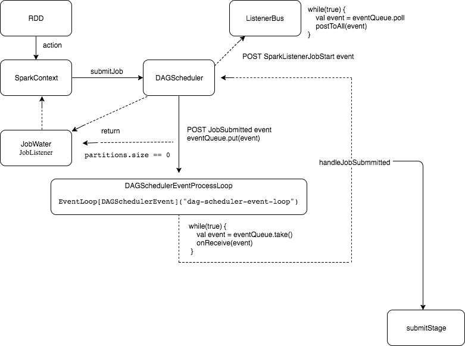

### DAGScheduler

--
DAGScheduler把RDD血缘关系(逻辑计划)转化成由Stage组成的DAG(物理计划）执行。

内部依赖SparkContext， TaskScheduler， BlockManagerMaster， MapOutputTrackerMaster和LiveListenerBus等模块， 现仅对事件调度做分析。

#### 0. 关键成员变量

```scala
  // job、stage的关联
  // next job ID
  private[scheduler] val nextJobId = new AtomicInteger(0)
  // next stage ID
  private val nextStageId = new AtomicInteger(0)
  // jobId -> {stageId1, stageId2 ... stageIdN}
  private[scheduler] val jobIdToStageIds = new HashMap[Int, HashSet[Int]]
  // stageId -> stage
  private[scheduler] val stageIdToStage = new HashMap[Int, Stage]
  // shuffleId -> shuffleMapStage
  private[scheduler] val shuffleToMapStage = new HashMap[Int, ShuffleMapStage]

  // 待运行、运行中和运行失败的Stage
  private[scheduler] val waitingStages = new HashSet[Stage]
  private[scheduler] val runningStages = new HashSet[Stage
  private[scheduler] val failedStages = new HashSet[Stage]

  // RDD的cache位置， rddId -> [0:host0, 1:host2 ... n:hostx]
  private val cacheLocs = new HashMap[Int, IndexedSeq[Seq[TaskLocation]]]

  // eventLoop
  private[scheduler] val eventProcessLoop = new DAGSchedulerEventProcessLoop(this)
  taskScheduler.setDAGScheduler(this)
```
  

#### 1. DAGSchedulerEventLoop：

DAGScheduler提供的核心功能就是利用DAGSchedulerEventLoop这个事件循环处理各种DAGSchedulerEvent

```scala
/* 继承自EventLoop抽象类 */
private[scheduler] class DAGSchedulerEventProcessLoop(dagScheduler: DAGScheduler)
  extends EventLoop[DAGSchedulerEvent]("dag-scheduler-event-loop") with Logging {

  private[this] val timer = dagScheduler.metricsSource.messageProcessingTimer

  /**
   * The main event loop of the DAG scheduler.
   * 重载onReceive方法
   */
  override def onReceive(event: DAGSchedulerEvent): Unit = {
    val timerContext = timer.time()
    try {
      // 具体的onReceive处理逻辑
      doOnReceive(event)
    } finally {
      timerContext.stop()
    }
  }
  
  /**
   * 接收一个DAGSchedulerEvent，通过模式匹配处理不同类型的event
   * event的定义见下面的DAGSchedulerEvent
   */
  private def doOnReceive(event: DAGSchedulerEvent): Unit = event match {
    case JobSubmitted(jobId, rdd, func, partitions, callSite, listener, properties) =>
      dagScheduler.handleJobSubmitted(jobId, rdd, func, partitions, callSite, listener, properties)

    case ...

    case ResubmitFailedStages =>
      dagScheduler.resubmitFailedStages()
  }
}
```

#### 2. DAGSchedulerEvent

定义了一系列DAGSchedulerEvent类型的case class, 包括：

* JobSubmitted
* MapStageSubmitted
* StageCancelled
* JobCancelled
* JobGroupCancelled
* AllJobsCancelled
* BeginEvent
* GettingResultEvent
* CompletionEvent
* ExecutorAdded
* ExecutorLost
* TaskSetFailed
* ResubmitFailedStages

在DAGScheduler内部实现的DAGSchedulerEventProcessLoop会对上面声明的各种event做onReceive()处理。

```scala
package org.apache.spark.scheduler

import java.util.Properties

import scala.collection.Map
import scala.language.existentials

import org.apache.spark._
import org.apache.spark.executor.TaskMetrics
import org.apache.spark.rdd.RDD
import org.apache.spark.util.CallSite

/**
 * A sealed trait can be extended only in the same file as its declaration.
 *
 * Types of events that can be handled by the DAGScheduler. The DAGScheduler uses an event queue
 * architecture where any thread can post an event (e.g. a task finishing or a new job being
 * submitted) but there is a single "logic" thread that reads these events and takes decisions.
 * This greatly simplifies synchronization.
 */
 
private[scheduler] sealed trait DAGSchedulerEvent

/** A result-yielding job was submitted on a target RDD */
private[scheduler] case class JobSubmitted(
    jobId: Int,
    finalRDD: RDD[_],
    func: (TaskContext, Iterator[_]) => _,
    partitions: Array[Int],
    callSite: CallSite,
    listener: JobListener,
    properties: Properties = null)
  extends DAGSchedulerEvent

/** A map stage as submitted to run as a separate job */
private[scheduler] case class MapStageSubmitted(
  jobId: Int,
  dependency: ShuffleDependency[_, _, _],
  callSite: CallSite,
  listener: JobListener,
  properties: Properties = null)
  extends DAGSchedulerEvent

private[scheduler] case class StageCancelled(stageId: Int) extends DAGSchedulerEvent

private[scheduler] case class JobCancelled(jobId: Int) extends DAGSchedulerEvent

private[scheduler] case class JobGroupCancelled(groupId: String) extends DAGSchedulerEvent

private[scheduler] case object AllJobsCancelled extends DAGSchedulerEvent

private[scheduler]
case class BeginEvent(task: Task[_], taskInfo: TaskInfo) extends DAGSchedulerEvent

private[scheduler]
case class GettingResultEvent(taskInfo: TaskInfo) extends DAGSchedulerEvent

private[scheduler] case class CompletionEvent(
    task: Task[_],
    reason: TaskEndReason,
    result: Any,
    accumUpdates: Map[Long, Any],
    taskInfo: TaskInfo,
    taskMetrics: TaskMetrics)
  extends DAGSchedulerEvent

private[scheduler] case class ExecutorAdded(execId: String, host: String) extends DAGSchedulerEvent

private[scheduler] case class ExecutorLost(execId: String) extends DAGSchedulerEvent

private[scheduler]
case class TaskSetFailed(taskSet: TaskSet, reason: String, exception: Option[Throwable])
  extends DAGSchedulerEvent

private[scheduler] case object ResubmitFailedStages extends DAGSchedulerEvent

```

#### 3. submitJob事件
流层图如下：


DAGScheduler内部其实用了2个EventLoop： DAGSchedulerEventProcessLoop和ListenerBus

**handleJobSubmitted**内部调用submitStage方法,这里会根据RDD的依赖关系，递归的查找上游依赖的stage并执行submitStatge方法

```scala
 /** Submits stage, but first recursively submits any missing parents. */
  private def submitStage(stage: Stage) {
    val jobId = activeJobForStage(stage)
    if (jobId.isDefined) {
      logDebug("submitStage(" + stage + ")")
      if (!waitingStages(stage) && !runningStages(stage) && !failedStages(stage)) {
        val missing = getMissingParentStages(stage).sortBy(_.id)
        logDebug("missing: " + missing)
        // 如果当前stage上游没有带运行的stage，直接提交task
        if (missing.isEmpty) {
          logInfo("Submitting " + stage + " (" + stage.rdd + "), which has no missing parents")
          submitMissingTasks(stage, jobId.get)
        } else {
          for (parent <- missing) {
            submitStage(parent)
          }
          waitingStages += stage
        }
      }
    } else {
      abortStage(stage, "No active job for stage " + stage.id, None)
    }
  }
```
submitStage内部调用了getMissingParentStage方法:

```scala
  private def getMissingParentStages(stage: Stage): List[Stage] = {
    val missing = new HashSet[Stage]
    val visited = new HashSet[RDD[_]]
    // We are manually maintaining a stack here to prevent StackOverflowError
    // caused by recursively visiting
    val waitingForVisit = new Stack[RDD[_]]
    def visit(rdd: RDD[_]) {
      if (!visited(rdd)) {
        visited += rdd
        val rddHasUncachedPartitions = getCacheLocs(rdd).contains(Nil)
        if (rddHasUncachedPartitions) {
          // 根据stage中RDD的依赖获取上游需要执行的shuffleMapStage
          for (dep <- rdd.dependencies) {
            dep match {
               // 宽依赖，根据shufDep.shuffleId获取stage
              case shufDep: ShuffleDependency[_, _, _] =>
                val mapStage = getShuffleMapStage(shufDep, stage.firstJobId)
                if (!mapStage.isAvailable) {
                  missing += mapStage
                }
              // 窄依赖，则继续递归 
              case narrowDep: NarrowDependency[_] =>
                waitingForVisit.push(narrowDep.rdd)
            }
          }
        }
      }
    }
    waitingForVisit.push(stage.rdd)
    while (waitingForVisit.nonEmpty) {
      visit(waitingForVisit.pop())
    }
    missing.toList
  }
```

**JobWaiter**接口：

```scala

  // job成功，设置jobResult为JobSucceeded, 并执行notifyAll
  override def taskSucceeded(index: Int, result: Any): Unit = synchronized {
    if (_jobFinished) {
      throw new UnsupportedOperationException("taskSucceeded() called on a finished JobWaiter")
    }
    resultHandler(index, result.asInstanceOf[T])
    finishedTasks += 1
    if (finishedTasks == totalTasks) {
      _jobFinished = true
      jobResult = JobSucceeded
      this.notifyAll()
    }
  }

  // job失败，设置jobResult为JobFailed, 并执行notifyAll
  override def jobFailed(exception: Exception): Unit = synchronized {
    _jobFinished = true
    jobResult = JobFailed(exception)
    this.notifyAll()
  }

  // awaitResult使线程执行wait
  def awaitResult(): JobResult = synchronized {
    while (!_jobFinished) {
      this.wait()
    }
    return jobResult
  }
```

**JobWatcher**的使用：wait直到其他线程有notify：

```scala
    val waiter = submitJob(rdd, func, partitions, callSite, resultHandler, properties)
    waiter.awaitResult() match {
      case JobSucceeded => ...
      case JobFailed(exception: Exception) => ...
    }

```


