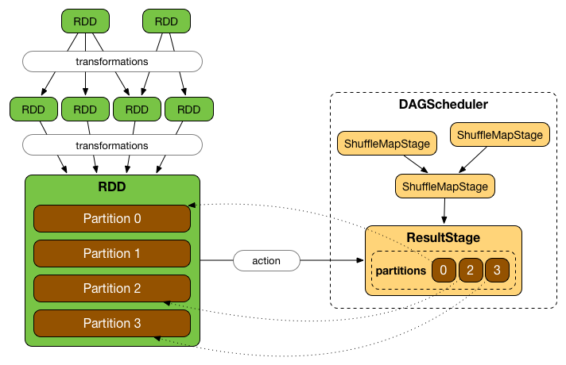

### Stage

Stage是Spark调度执行的物理单元

#### Spark1.6版本Stage源码：


```scala
package org.apache.spark.scheduler

import scala.collection.mutable.HashSet

import org.apache.spark._
import org.apache.spark.rdd.RDD
import org.apache.spark.util.CallSite

/**
 * A stage is a set of parallel tasks all computing the same function that need to run as part
 * of a Spark job, where all the tasks have the same shuffle dependencies. Each DAG of tasks run
 * by the scheduler is split up into stages at the boundaries where shuffle occurs, and then the
 * DAGScheduler runs these stages in topological order.
 * 
 * Stage由一组相同的Task组成，划分Stage的边界是Shuffle
 *
 * Each Stage can either be a shuffle map stage, in which case its tasks' results are input for
 * other stage(s), or a result stage, in which case its tasks directly compute a Spark action
 * (e.g. count(), save(), etc) by running a function on an RDD. For shuffle map stages, we also
 * track the nodes that each output partition is on.

 * Stage分为ShuffleMapStage和ResultStage
 *
 * Each Stage also has a firstJobId, identifying the job that first submitted the stage.  When FIFO
 * scheduling is used, this allows Stages from earlier jobs to be computed first or recovered
 * faster on failure.
 *
 * Stage可以重试
 *
 * Finally, a single stage can be re-executed in multiple attempts due to fault recovery. In that
 * case, the Stage object will track multiple StageInfo objects to pass to listeners or the web UI.
 * The latest one will be accessible through latestInfo.
 *
 * @param id Unique stage ID
 * @param rdd RDD that this stage runs on: for a shuffle map stage, it's the RDD we run map tasks
 *   on, while for a result stage, it's the target RDD that we ran an action on
 * @param numTasks Total number of tasks in stage; result stages in particular may not need to
 *   compute all partitions, e.g. for first(), lookup(), and take().
 * @param parents List of stages that this stage depends on (through shuffle dependencies).
 * @param firstJobId ID of the first job this stage was part of, for FIFO scheduling.
 * @param callSite Location in the user program associated with this stage: either where the target
 *   RDD was created, for a shuffle map stage, or where the action for a result stage was called.
 */
private[scheduler] abstract class Stage(
    val id: Int,
    val rdd: RDD[_],
    val numTasks: Int,
    val parents: List[Stage],  // parents是Stage List,作用DAG的连接关系
    val firstJobId: Int,
    val callSite: CallSite)
  extends Logging {

  val numPartitions = rdd.partitions.length

  /** Set of jobs that this stage belongs to. */
  val jobIds = new HashSet[Int]

  val pendingPartitions = new HashSet[Int]

  /** The ID to use for the next new attempt for this stage. */
  private var nextAttemptId: Int = 0

  val name: String = callSite.shortForm
  val details: String = callSite.longForm

  private var _internalAccumulators: Seq[Accumulator[Long]] = Seq.empty

  /** Internal accumulators shared across all tasks in this stage. */
  def internalAccumulators: Seq[Accumulator[Long]] = _internalAccumulators

  /**
   * Re-initialize the internal accumulators associated with this stage.
   *
   * This is called every time the stage is submitted, *except* when a subset of tasks
   * belonging to this stage has already finished. Otherwise, reinitializing the internal
   * accumulators here again will override partial values from the finished tasks.
   */
  def resetInternalAccumulators(): Unit = {
    _internalAccumulators = InternalAccumulator.create(rdd.sparkContext)
  }

  /**
   * Pointer to the [StageInfo] object for the most recent attempt. This needs to be initialized
   * here, before any attempts have actually been created, because the DAGScheduler uses this
   * StageInfo to tell SparkListeners when a job starts (which happens before any stage attempts
   * have been created).
   */
  private var _latestInfo: StageInfo = StageInfo.fromStage(this, nextAttemptId)

  /**
   * Set of stage attempt IDs that have failed with a FetchFailure. We keep track of these
   * failures in order to avoid endless retries if a stage keeps failing with a FetchFailure.
   * We keep track of each attempt ID that has failed to avoid recording duplicate failures if
   * multiple tasks from the same stage attempt fail (SPARK-5945).
   */
  private val fetchFailedAttemptIds = new HashSet[Int]

  private[scheduler] def clearFailures() : Unit = {
    fetchFailedAttemptIds.clear()
  }

  /**
   * Check whether we should abort the failedStage due to multiple consecutive fetch failures.
   *
   * This method updates the running set of failed stage attempts and returns
   * true if the number of failures exceeds the allowable number of failures.
   * 
   * 检查是否需要放弃当前失败的Stage
   */
  private[scheduler] def failedOnFetchAndShouldAbort(stageAttemptId: Int): Boolean = {
    fetchFailedAttemptIds.add(stageAttemptId)
    fetchFailedAttemptIds.size >= Stage.MAX_CONSECUTIVE_FETCH_FAILURES
  }

  /** Creates a new attempt for this stage by creating a new StageInfo with a new attempt ID. 
   *
   * 重试Stage
   */
  def makeNewStageAttempt(
      numPartitionsToCompute: Int,
      taskLocalityPreferences: Seq[Seq[TaskLocation]] = Seq.empty): Unit = {
    _latestInfo = StageInfo.fromStage(
      this, nextAttemptId, Some(numPartitionsToCompute), taskLocalityPreferences)
    nextAttemptId += 1
  }

  /** Returns the StageInfo for the most recent attempt for this stage. */
  def latestInfo: StageInfo = _latestInfo

  override final def hashCode(): Int = id

  override final def equals(other: Any): Boolean = other match {
    case stage: Stage => stage != null && stage.id == id
    case _ => false
  }

  /** Returns the sequence of partition ids that are missing (i.e. needs to be computed). 
  * 获取未完成的parition
  */
  def findMissingPartitions(): Seq[Int]
}

private[scheduler] object Stage {
  // The number of consecutive failures allowed before a stage is aborted
  // 最多重试4次
  val MAX_CONSECUTIVE_FETCH_FAILURES = 4
}

```

#### ShuffleMapStage和ResultStage
如图所示：

ShuffleMapStage是Job中间执行过程的Stage， ResultStage是Job最后一个Stage
