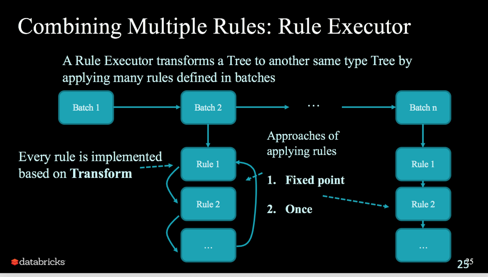

### RuleExecutor

#### spark sql优化规则执行器
如图所示：ruleExecutor的作用是分批次(batch)执行一系列的优化规则直到稳定点(fixpoint)或最大迭代次数


源码如下：

```scala
/** 优化规则执行器 */
abstract class RuleExecutor[TreeType <: TreeNode[_]] extends Logging {

  /** 控制运行次数的策略，如果在达到最大迭代次数前到达稳定点就停止运行 */
  abstract class Strategy { def maxIterations: Int }

  /** 只运行一次的策略 */
  case object Once extends Strategy { val maxIterations = 1 }

  /** 运行到稳定点或者最大迭代次数的策略，2选1 */
  case class FixedPoint(maxIterations: Int) extends Strategy

  /** 一批规则 */
  protected case class Batch(name: String, strategy: Strategy, rules: Rule[TreeType]*)

  /** Defines a sequence of rule batches, to be overridden by the implementation. */
  protected val batches: Seq[Batch]


  /**
   * 执行器入口
   Executes the batches of rules defined by the subclass. The batches are executed serially
   * using the defined execution strategy. Within each batch, rules are also executed serially.
   */
  def execute(plan: TreeType): TreeType = {
    var curPlan = plan

    batches.foreach { batch =>
      // 用来对比执行规则前后，初始的plan有无变化
      val batchStartPlan = curPlan
      var iteration = 1
      var lastPlan = curPlan
      var continue = true

      // 执行直到达到稳定点或者最大迭代次数
      while (continue) {
        curPlan = batch.rules.foldLeft(curPlan) {
          case (plan, rule) =>
            val startTime = System.nanoTime()
            val result = rule(plan)
            val runTime = System.nanoTime() - startTime
            RuleExecutor.timeMap.addAndGet(rule.ruleName, runTime)

            if (!result.fastEquals(plan)) {
              logTrace(
                s"""
                  |=== Applying Rule ${rule.ruleName} ===
                  |${sideBySide(plan.treeString, result.treeString).mkString("\n")}
                """.stripMargin)
            }

            result
        }
        iteration += 1
        // 到达最大迭代次数, 不再执行优化
        if (iteration > batch.strategy.maxIterations) {
          // 只对最大迭代次数大于1的情况打log
          if (iteration != 2) {
            logInfo(s"Max iterations (${iteration - 1}) reached for batch ${batch.name}")
          }
          continue = false
        }

		 // plan不变了，到达稳定点，不再执行优化
        if (curPlan.fastEquals(lastPlan)) {
          logTrace(
            s"Fixed point reached for batch ${batch.name} after ${iteration - 1} iterations.")
          continue = false
        }
        lastPlan = curPlan
      }

      if (!batchStartPlan.fastEquals(curPlan)) {
        logDebug(
          s"""
          |=== Result of Batch ${batch.name} ===
          |${sideBySide(plan.treeString, curPlan.treeString).mkString("\n")}
        """.stripMargin)
      } else {
        logTrace(s"Batch ${batch.name} has no effect.")
      }
    }

    curPlan
  }
}
```