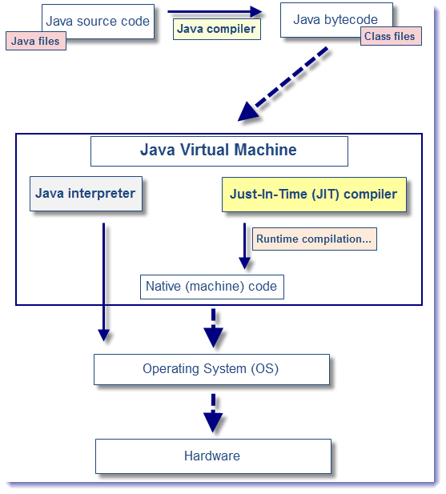

#JIT技术

### AOT和JIT

* **事前编译AOT**(Ahead Of Time compilation)，指在程序运行前编译，也称为静态编译
* **即时编译JIT**（Just In Time compilation), 指当某段代码即将第一次被执行时进行编译，是动态编译的一种特例


在部分商用虚拟机中（如HotSpot），Java程序最初是通过解释器（Interpreter）进行解释执行的，当虚拟机发现某个方法或代码块的运行特别频繁时，就会把这些代码认定为“热点代码”。**为了提高热点代码的执行效率，在运行时，虚拟机将会把这些代码编译成与本地平台相关的机器码，并进行各种层次的优化，完成这个任务的编译器称为即时编译器（Just In Time Compiler，下文统称JIT编译器）**, 如图所示：


    
 （图片出自：[https://www.javacodegeeks.com/2013/07/java-just-in-time-compilation-more-than-just-a-buzzword.html](https://www.javacodegeeks.com/2013/07/java-just-in-time-compilation-more-than-just-a-buzzword.html)）

###为什么HotSpot虚拟机要使用解释器与编译器并存的架构？


尽管并不是所有的Java虚拟机都采用解释器与编译器并存的架构，但许多主流的商用虚拟机（如HotSpot），都同时包含解释器和编译器。解释器与编译器两者各有优势：

- 当程序需要迅速启动和执行的时候，解释器可以首先发挥作用，省去编译的时间，立即执行。
- 在程序运行后，随着时间的推移，编译器逐渐发挥作用，把越来越多的代码编译成本地代码之后，可以获取更高的执行效率。


###编译的时间开销

解释器的执行，抽象的看是这样的：

```shell
输入的代码 -> [ 解释器 解释执行 ] -> 执行结果
```

而要JIT编译然后再执行的话，抽象的看则是：

```shell
输入的代码 -> [ 编译器 编译 ] -> 编译后的代码 -> [ 执行 ] -> 执行结果
```
说JIT比解释快，其实说的是“执行编译后的代码”比“解释器解释执行”要快，并不是说“编译”这个动作比“解释”这个动作快。

所以，对“只执行一次”的代码而言，解释执行其实总是比JIT编译执行要快。

怎么算是“只执行一次的代码”呢？粗略说，下面两个条件同时满足时就是严格的“只执行一次”:

* 只被调用一次，例如类的构造器（class initializer，\<clinit\>()）
* 没有循环

对只执行一次的代码做JIT编译再执行，可以说是得不偿失。
对只执行少量次数的代码，JIT编译带来的执行速度的提升也未必能抵消掉最初编译带来的开销。
只有对频繁执行的代码，JIT编译才能保证有正面的收益。

###编译的空间开销

对一般的Java方法而言，编译后代码的大小相对于字节码的大小，膨胀比达到10x是很正常的。同上面说的时间开销一样，这里的空间开销也是，只有对执行频繁的代码才值得编译，如果把所有代码都编译则会显著增加代码所占空间，导致“代码爆炸”。

这也就解释了为什么有些JVM会选择不总是做JIT编译，而是选择用解释器+JIT编译器的混合执行引擎。


###为何HotSpot虚拟机要实现两个不同的即时编译器？

HotSpot虚拟机中内置了两个即时编译器：Client Complier和Server Complier，简称为C1、C2编译器，分别用在客户端和服务端。目前主流的HotSpot虚拟机中默认是采用解释器与其中一个编译器直接配合的方式工作。程序使用哪个编译器，取决于虚拟机运行的模式。HotSpot虚拟机会根据自身版本与宿主机器的硬件性能自动选择运行模式，用户也可以使用“-client”或“-server”参数去强制指定虚拟机运行在Client模式或Server模式。

用Client Complier获取更高的编译速度，用Server Complier 来获取更好的编译质量。为什么提供多个即时编译器与为什么提供多个垃圾收集器类似，都是为了适应不同的应用场景。

###哪些程序代码会被编译为本地代码？如何编译为本地代码？

程序中的代码只有是热点代码时，才会编译为本地代码，那么什么是热点代码呢？
运行过程中会被即时编译器编译的“热点代码”有两类：

* 被多次调用的方法。
* 被多次执行的循环体。

两种情况，编译器都是以整个方法作为编译对象。 这种编译方法因为编译发生在方法执行过程之中，因此形象的称之为**栈上替换（On Stack Replacement，OSR）**，即方法栈帧还在栈上，方法就被替换了。

###如何判断方法或一段代码或是不是热点代码呢？

要知道方法或一段代码是不是热点代码，是不是需要触发即时编译，需要进行Hot Spot Detection（热点探测）。
目前主要的热点探测方式有以下两种：

**1. 基于采样的热点探测**

采用这种方法的虚拟机会周期性地检查各个线程的栈顶，如果发现某些方法经常出现在栈顶，那这个方法就是“热点方法”。这种探测方法的好处是实现简单高效，还可以很容易地获取方法调用关系（将调用堆栈展开即可），缺点是很难精确地确认一个方法的热度，容易因为受到线程阻塞或别的外界因素的影响而扰乱热点探测。

**2. 基于计数器的热点探测**

采用这种方法的虚拟机会为每个方法（甚至是代码块）建立计数器，统计方法的执行次数，如果执行次数超过一定的阀值，就认为它是“热点方法”。这种统计方法实现复杂一些，需要为每个方法建立并维护计数器，而且不能直接获取到方法的调用关系，但是它的统计结果相对更加精确严谨。

**在HotSpot虚拟机中使用的是第二种——基于计数器的热点探测方法，因此它为每个方法准备了两个计数器：方法调用计数器和回边计数器。在确定虚拟机运行参数的前提下，这两个计数器都有一个确定的阈值，当计数器超过阈值溢出了，就会触发JIT编译。**

**方法调用计数器:** 这个计数器用于统计方法被调用的次数。
当一个方法被调用时，会先检查该方法是否存在被JIT编译过的版本，如果存在，则优先使用编译后的本地代码来执行。如果不存在已被编译过的版本，则将此方法的调用计数器值加1，然后判断方法调用计数器与回边计数器值之和是否超过方法调用计数器的阈值。如果超过阈值，那么将会向即时编译器提交一个该方法的代码编译请求。

**回边计数器:** 它的作用就是统计一个方法中循环体代码执行的次数，在字节码中遇到控制流向后跳转的指令称为“回边”。


###参考
* [《深入理解Java虚拟机》](https://book.douban.com/subject/24722612/)
* [http://blog.csdn.net/sunxianghuang/article/details/52094859](http://blog.csdn.net/sunxianghuang/article/details/52094859)
* [https://zhuanlan.zhihu.com/p/19977592](http://blog.csdn.net/u010412719/article/details/47008717)
* [http://www.zhihu.com/question/37389356/answer/73820511](http://www.zhihu.com/question/37389356/answer/73820511)
* [https://www.javacodegeeks.com/2013/07/java-just-in-time-compilation-more-than-just-a-buzzword.html](https://www.javacodegeeks.com/2013/07/java-just-in-time-compilation-more-than-just-a-buzzword.html)
